# Sync Architecture

This document explains how the bidirectional GitHub ↔ GitLab synchronization works.

## 🔄 Overview

The repository uses the [advanced-git-sync](https://github.com/OpenSaucedHub/advanced-git-sync)
GitHub Action for **true bidirectional synchronization** between GitHub and GitLab.

## 🏗️ Architecture

### Single Source of Truth

- **GitHub Actions** handles ALL synchronization
- **No GitLab CI/CD sync jobs** (removed redundancy)
- **Centralized configuration** in `.github/sync-config.yml`

### Sync Flow

```mermaid
graph TD
    A[GitHub Push/PR/Issue] --> B[GitHub Actions Triggered]
    C[GitLab Push/MR/Issue] --> B
    B --> D[advanced-git-sync Action]
    D --> E{Config Analysis}
    E --> F[Sync GitHub → GitLab]
    E --> G[Sync GitLab → GitHub]
    F --> H[GitLab Updated]
    G --> I[GitHub Updated]
    H --> J[Container Builds Triggered]
    I --> J
```



## ⚙️ Configuration

### Sync Rules (`.github/sync-config.yml`)

```yaml
# GitHub → GitLab sync
gitlab:
  enabled: true
  owner: vikshan
  sync:
    branches: ✅ All branches with pattern "*"
    pullRequests: ✅ With labels ["synced", "github-origin"]
    issues: ✅ With labels ["synced", "github-origin"]
    releases: ✅ All releases
    tags: ✅ All tags

# GitLab → GitHub sync
github:
  enabled: true
  sync:
    branches: ✅ All branches with pattern "*"
    pullRequests: ✅ With labels ["synced", "gitlab-origin"]
    issues: ✅ With labels ["synced", "gitlab-origin"]
    releases: ✅ All releases
    tags: ✅ All tags
```

### Triggers (`.github/workflows/sync.yml`)

- **Push** to main branch
- **Pull Request** events (opened, closed, reopened)
- **Issues** events (opened, closed, reopened)
- **Releases** published
- **Schedule** every 6 hours
- **Manual** workflow dispatch

## 🔒 Loop Prevention

The advanced-git-sync action includes **built-in loop prevention**:

1. **Smart Detection** - Recognizes synced content
2. **Label Tracking** - Uses origin labels to track sync direction
3. **Content Comparison** - Only syncs meaningful changes
4. **Commit Analysis** - Avoids re-syncing already synced commits

### Origin Labels

- `synced` + `github-origin` = Content originated from GitHub
- `synced` + `gitlab-origin` = Content originated from GitLab

## 🚀 Benefits

### ✅ Advantages of New Architecture

1. **No Sync Loops** - Built-in intelligent loop prevention
2. **Single Configuration** - One place to manage all sync rules
3. **Better Reliability** - GitHub Actions more stable than GitLab CI
4. **Comprehensive Sync** - Handles branches, PRs/MRs, issues, releases, tags
5. **Automatic Labeling** - Clear origin tracking
6. **Protected Branch Support** - Respects branch protection rules

### 🔄 What Gets Synced

| Entity            | GitHub → GitLab     | GitLab → GitHub     | Notes                             |
| ----------------- | ------------------- | ------------------- | --------------------------------- |
| **Branches**      | ✅                  | ✅                  | All branches, including protected |
| **Pull Requests** | ✅ → Merge Requests | ✅ ← Merge Requests | With origin labels                |
| **Issues**        | ✅                  | ✅                  | With origin labels                |
| **Releases**      | ✅                  | ✅                  | Full release data                 |
| **Tags**          | ✅                  | ✅                  | Automatic with releases           |

## 🛠️ Maintenance

### Monitoring Sync Health

1. **Check GitHub Actions** - Monitor sync workflow runs
2. **Review Labels** - Ensure proper origin labeling
3. **Verify Triggers** - Confirm all events trigger sync

### Troubleshooting

#### Sync Not Working

1. Check GitHub Actions logs
2. Verify token permissions
3. Review sync configuration

#### Partial Sync

1. Check entity-specific configuration
2. Verify label filters
3. Review branch patterns

#### Loop Detection

1. Check for missing origin labels
2. Review commit messages
3. Verify content comparison logic

## 📊 Monitoring

### Key Metrics to Watch

- **Sync Success Rate** - Percentage of successful syncs
- **Sync Latency** - Time between trigger and completion
- **Entity Coverage** - Which entities are syncing properly
- **Error Patterns** - Common failure modes

### Health Checks

```bash
# Check recent sync runs
gh run list --workflow=sync.yml --limit=10

# Check sync configuration
cat .github/sync-config.yml

# Verify labels on synced items
gh issue list --label="synced"
gh pr list --label="synced"
```

## 🔮 Future Enhancements

Potential improvements to consider:

1. **Selective Sync** - Branch-specific rules
2. **Conflict Resolution** - Automated merge conflict handling
3. **Sync Analytics** - Detailed sync metrics
4. **Custom Labels** - Project-specific labeling schemes
5. **Webhook Integration** - Real-time sync triggers

## 📚 References

- [advanced-git-sync Documentation](https://github.com/OpenSaucedHub/advanced-git-sync)
- [GitHub Actions Documentation](https://docs.github.com/en/actions)
- [GitLab API Documentation](https://docs.gitlab.com/ee/api/)

---

**Note**: This architecture replaces the previous dual-sync approach with a single, more reliable
solution.
