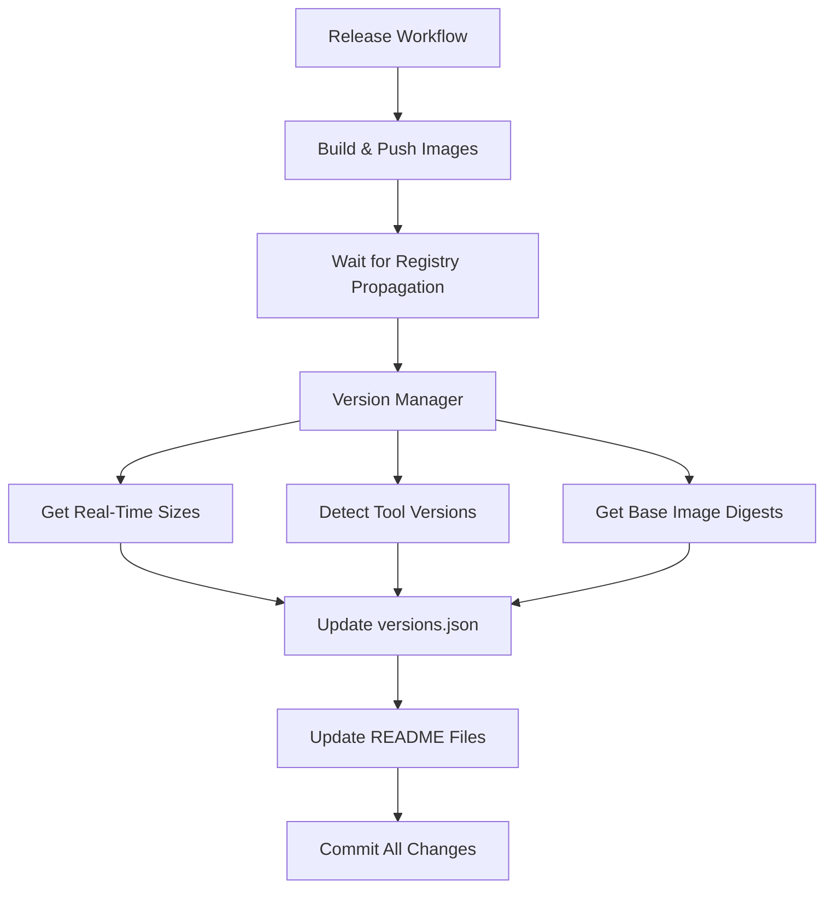

# Version and Size Management

This document explains how versions and image sizes are automatically tracked and synchronized
across all files and registries.

## 🎯 **The Challenge**

Previously, we had several issues:

1. **Manual version tracking** - Versions hardcoded in multiple places
2. **Size inconsistencies** - README sizes didn't match `versions.json`
3. **Timing issues** - Versions updated before images were actually built
4. **No real-time data** - Fallback to hardcoded values instead of actual registry data

## 🛠️ **The Solution: Integrated Version Manager**

### **New Architecture**



### **Core Components**

#### **1. `version-manager.ts` - Centralized Version Management**

- **Real-time size retrieval** from all registries (GHCR, GitLab, Docker Hub)
- **Automatic tool version detection** (Bun, Node.js, npm, Git)
- **Base image digest tracking** for precise version control
- **Synchronized updates** across `versions.json` and README files

#### **2. `update-versions-optimized.ts` - Smart Update Script**

- **Real-time data integration** instead of hardcoded fallbacks
- **Flexible operation modes** (full update vs. sync-only)
- **Proper error handling** with graceful fallbacks

## 📊 **How It Works**

### **During Releases**

1. **Images Built & Pushed** - All registries receive new images
2. **Wait Period** - 30-second delay for registry propagation
3. **Real-Time Data Collection**:
   - Query GHCR, GitLab, Docker Hub for actual image sizes
   - Detect tool versions from base images
   - Get latest base image digests
4. **Synchronized Updates**:
   - Update `versions.json` with real data
   - Update all README files with consistent sizes
   - Commit all changes together

### **Manual Size Sync**

```bash
# Sync sizes between README and versions.json
bun run sync-sizes

# Full version update with real-time data
bun run update-versions-optimized --version=1.0.5
```

## 🔄 **Data Flow**

### **Size Synchronization**

| Source               | Target          | Method                  |
| -------------------- | --------------- | ----------------------- |
| **All Registries** → | `versions.json` | Real-time API queries   |
| **All Registries** → | README files    | Image operations module |
| **versions.json** ↔ | README files    | Bidirectional sync      |

### **Version Detection**

| Component   | Detection Method        | Example                              |
| ----------- | ----------------------- | ------------------------------------ |
| **Bun**     | Base image analysis     | `1.2.19`                             |
| **Node.js** | LTS version tracking    | `v24.5.0`                            |
| **npm**     | Node.js version mapping | `11.5.1`                             |
| **Git**     | Base image specific     | `2.43.0` (Ubuntu), `2.39.5` (Alpine) |

## 📋 **Configuration**

### **Registry Mapping**

The system automatically maps registry URLs to keys:

- `ghcr.io/*` → `ghcr`
- `registry.gitlab.com/*` → `gitlab`
- `docker.io/*` → `dockerhub`

### **Image Definitions**

Centralized in `registry-client.ts`:

```typescript
export const IMAGE_DEFINITIONS = {
  names: ['bun', 'bun-node', 'ubuntu-bun', 'ubuntu-bun-node'],
  baseImages: {
    bun: 'oven/bun',
    'bun-node': 'oven/bun',
    'ubuntu-bun': 'library/ubuntu',
    'ubuntu-bun-node': 'library/ubuntu'
  }
}
```

## 🚀 **Benefits**

### **1. Accuracy**

- **Real-time data** from actual registries
- **No hardcoded fallbacks** that become stale
- **Consistent sizes** across all documentation

### **2. Automation**

- **Zero manual intervention** required
- **Automatic synchronization** during releases
- **Proper timing** ensures data accuracy

### **3. Reliability**

- **Graceful error handling** with meaningful fallbacks
- **Registry propagation delays** accounted for
- **Atomic updates** prevent inconsistent states

### **4. Maintainability**

- **Single source of truth** for version logic
- **Centralized configuration** for easy updates
- **Clear separation** of concerns

## 🔧 **Usage Examples**

### **Release Workflow (Automatic)**

```yaml
- name: Update versions and sizes
  run: |
    # Wait for registry propagation
    sleep 30

    # Update with real-time data
    bun scripts/update-versions-optimized.ts --version=${{ env.VERSION }}

    # Sync README sizes
    bun run s

    # Commit everything
    git add versions.json README.md base/*/README.md
    git commit -m "chore: update versions and sizes [skip-sync]"
```

### **Manual Operations**

```bash
# Just sync sizes (no version change)
bun run sync-sizes
# or bun run s

# Full version update
bun run update-versions-optimized --version=1.0.5 --notes="Bug fixes,Performance improvements"

# Check what would be updated (dry run)
bun scripts/version-manager.ts --dry-run
```

## 📈 **Monitoring**

### **Size Tracking**

The system tracks:

- **Image sizes** across all registries
- **Layer counts** for optimization analysis
- **Size differences** between registries
- **Historical changes** in versions.json

### **Version Tracking**

- **Base image digests** for precise tracking
- **Tool versions** with automatic detection
- **Release timestamps** for audit trails
- **Next release estimates** based on schedule

## 🐛 **Troubleshooting**

### **Size Mismatches**

```bash
# Force sync all sizes
bun run sync-sizes

# Check registry availability
bun scripts/version-manager.ts --check-registries
```

### **Version Detection Issues**

```bash
# Manual version update with specific values
bun run update-versions-optimized --version=1.0.5 --force-tools="bun:1.2.19,node:v24.5.0"
```

### **Registry Delays**

If sizes appear as 0 or outdated:

1. **Wait longer** - Some registries take time to propagate
2. **Check registry status** - Ensure all registries are accessible
3. **Manual fallback** - Use `--fallback-to-readme` flag

## 🔮 **Future Enhancements**

1. **Container Inspection** - Run actual commands in containers to get precise tool versions
2. **Size History** - Track size changes over time for optimization insights
3. **Registry Health Checks** - Monitor registry availability and performance
4. **Automated Optimization** - Suggest Dockerfile improvements based on size analysis
5. **Multi-Architecture Support** - Track sizes for different CPU architectures

---

This system ensures that **all version and size information is always accurate, consistent, and
automatically maintained** across the entire project! 🎉
